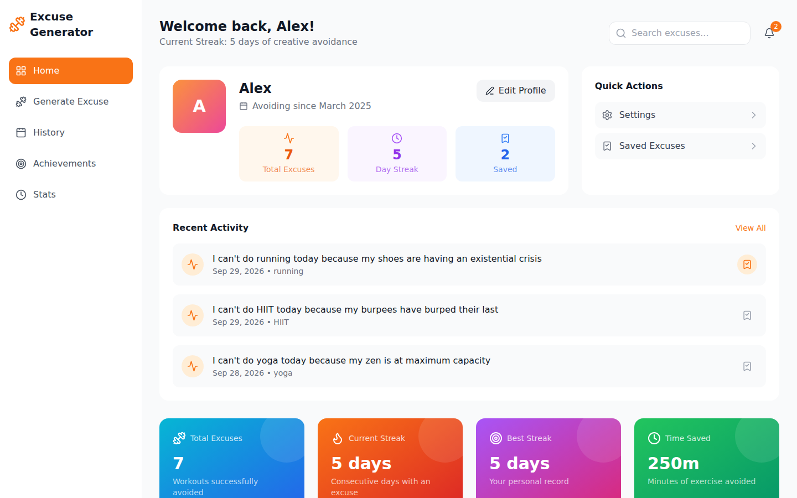

# Workout Excuse Generator

Generate creative excuses for skipping workouts, track your streak of avoidance, and earn achievements for it. A small full-stack toy: a React front end and a tiny Express API that picks the excuses.



**Status:** side project, maintained casually. No accounts and no tracking; everything you generate stays in your browser's local storage.

## What it does

- Generates an excuse for a workout type, duration and intensity, with a counter-motivation to keep you honest
- Keeps a history you can search, filter by type and date range, and save favourites from
- Tracks your current and best streak of consecutive excuse days
- Unlocks nine achievements, from *Beginner Procrastinator* to *Marathon Skipper*
- Charts weekly activity, workout and intensity distribution, and the duration trend
- Dark mode, a profile with a local avatar, copy or share an excuse

## Quickstart

Requires Node.js 20 or newer.

```bash
git clone https://github.com/fabiolauria92/workout-excuse-generator.git
cd workout-excuse-generator
npm install
npm run dev
```

Open http://localhost:5173. `npm run dev` starts the Vite dev server and the API on port 8000 together; the dev server proxies `/generate-excuse` to the API.

### Production

```bash
npm run build   # client → dist/
npm start       # serves dist/ and the API on http://localhost:8000
```

Set `PORT` to listen elsewhere.

## How it is put together

| Path | What it is |
|---|---|
| `src/` | React 19, TypeScript and Tailwind. Contexts hold history, streaks, preferences and notifications, all persisted to `localStorage`. |
| `api/main.js` | Express 5. `POST /generate-excuse` validates the request and answers with an excuse and a counter-motivation. In production it also serves `dist/`. |
| `api/excuses.js` | The excuse and counter-motivation lists. Add yours here. |

## API

```
POST /generate-excuse
{ "workout_type": "running", "duration": 30, "intensity": "moderate" }

→ { "excuse": "I can't do running today because …",
    "counter_motivation": "But remember: …",
    "workout_details": { "workout_type": "running", "duration_minutes": 30, "intensity": "moderate" } }
```

Workout types: `running`, `weightlifting`, `yoga`, `swimming`, `cycling`, `HIIT`. Duration 1–180 minutes. Intensity `light`, `moderate` or `intense`. Invalid input gets a `400` with an `error` message.

## Scripts

| Script | Does |
|---|---|
| `npm run dev` | client and API with hot reload |
| `npm run build` | production build of the client |
| `npm start` | serve the build and the API |
| `npm run lint` | ESLint |
| `npm run typecheck` | TypeScript |

CI runs lint, typecheck and build on every push and pull request.

## Tech stack

React 19, TypeScript, Vite, Tailwind CSS, Framer Motion, Recharts, Lucide icons, date-fns, Zod, Express.

## Contributing

Issues and pull requests are welcome. Run `npm run lint && npm run typecheck` before opening one.

## License

[MIT](LICENSE) © Fabio Lauria
